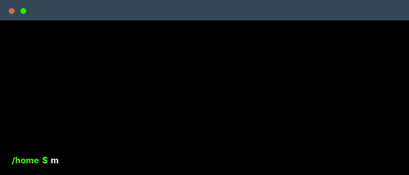

<!--
    Hey there, I'm Henrique Rodrigues!
    Happy to see you here exploring my profile.
-->

 

    

### Main skills

### Studying

### Currently listening to

### Connect with me!

  
  

### Employer?
> [!IMPORTANT]  
> Feel free to connect with me on [LinkedIn](https://www.linkedin.com/in/henriquesousarodrigues) or reach out directly at [henriquesrods@gmail.com](mailto:henriquesrods@gmail.com).

